# 🚀 Welcome to the Code Universe | Digital Workshop

<div align="center">


### ⚡ **Elite Fullstack Engineer** | **UI/UX Architect** | **Mobile Dev Wizard** 


<a href="https://github.com/blackscorche">

</a>

</div>

---

## 🎯 **Mission Control: Current Projects**

<div align="center">

| 🚀 **Active Project** | 💡 **Innovation Level** | 🔥 **Status** | 🛠️ **Tech Stack** |
|:---:|:---:|:---:|:---:|
| **[ScorchePay](https://scorchepay.vercel.app)** | `LEGENDARY` | `🔴 LIVE` | `React` `Node.js` `MongoDB` |
| **Personal Portfolio** | `PRO` | `🟢 DEPLOYED` | `Next.js` `Tailwind` `TypeScript` |
| **🔮 Blockchain Learning** | `RESEARCH` | `🟡 IN PROGRESS` | `Solidity` `Web3.js` `DApps` |

</div>

```javascript
const blackscorche = {
    name: "Abu Issa",
    role: "Fullstack Developer",
    location: "Nigeria 🇳🇬",
    currentFocus: "Building Scalable Web & Mobile Applications",
    
    expertise: {
        frontend: ["React", "Next.js", "TypeScript", "Tailwind CSS", "HTML5", "CSS3"],
        backend: ["Node.js", "Express.js", "Django", "Python", "JavaScript"],
        mobile: ["Flutter", "React Native", "Cross-platform Development"],
        databases: ["MongoDB", "MySQL", "Firebase"],
        tools: ["Git", "Docker", "AWS", "Figma", "Bootstrap"]
    },
    
    learning: {
        blockchain: ["Solidity", "Web3.js", "Smart Contracts", "DeFi"],
        advanced: ["Microservices", "GraphQL", "Redis", "Kubernetes"],
        ai_ml: ["TensorFlow", "Machine Learning APIs", "AI Integration"]
    },
    
    currentlyBuilding: "Next-generation web applications with modern tech",
    futureGoals: "Entering Web3 & blockchain development space",
    funFact: "I write code like I drink coffee — strong, fast, and slightly chaotic! ☕"
};
```

---

## ⚡ **Developer Analytics & Achievements**

<div align="center">

<p>
  
  &nbsp;&nbsp;&nbsp;
  
</p>

<br/>

<p>
  
</p>

<br/>

<p>
  
</p>

</div>

---

## 🛠️ **Tech Arsenal & Tools**

<div align="center">

### **🎨 Frontend Mastery**


### **⚙️ Backend Excellence**


### **📱 Mobile Development**


### **🗄️ Database & Storage**


### **🔧 DevOps & Tools**


### **🔮 Learning & Future Tech**


> 💡 **Note:** Blockchain technologies are part of my learning roadmap - coming soon!

</div>

---

## 🌟 **Featured Projects Portfolio**

<div align="center">

<table>
<tr>
<td width="50%">

### 🏦 **ScorchePay**
**Modern Payment Solution**
- 💳 Intuitive payment interface
- 🔐 Secure transaction handling  
- 📱 Responsive design
- ⚡ Fast processing engine
- 🎨 Modern UI/UX

**Tech:** `React` `Node.js` `MongoDB` `Express`

[](https://scorchepay.vercel.app)

</td>
<td width="50%">

### 💼 **Professional Portfolio**
**Showcase Platform**
- 🎨 Award-winning design
- ⚡ Lightning-fast performance
- 📊 Interactive project gallery
- 🔗 Integrated contact system
- 📱 Mobile-optimized

**Tech:** `Next.js` `TypeScript` `Tailwind CSS`

[](https://abuissaportfolio.vercel.app/)

</td>
</tr>
</table>

### 🔮 **Upcoming Projects**


</div>

---

## 📈 **Development Activity**

<div align="center">


</div>

---

## 💡 **What I'm Currently Up To**

```mermaid
graph TD
    A[🚀 Building ScorchePay] --> B[📱 Mobile App Development]
    A --> C[🌐 Web3 Research]
    B --> D[🔧 Performance Optimization]
    C --> E[📚 Blockchain Learning]
    E --> F[🎯 Smart Contract Development]
    F --> G[🌟 Future DeFi Projects]
```

<div align="center">



</div>

### 🎯 **Current Focus Areas:**
- 🔧 **Perfecting:** React, Node.js, Flutter development
- 📚 **Learning:** Blockchain, Solidity, Web3 development  
- 🚀 **Building:** ScorchePay enhancement & new features
- 🎨 **Improving:** UI/UX design skills and user experience
- 🌐 **Exploring:** AI integration in web applications

---

## 🤝 **Let's Connect & Build Together**

<div align="center">

### **Ready to Create Something Amazing?**

<a href="https://linkedin.com/in/abu-issa">

</a>
<a href="https://dev.to/blackscorche">

</a>
<a href="mailto:your.email@example.com">

</a>

### **💼 Available for:**
`Fullstack Development` • `Mobile Apps` • `UI/UX Design` • `Consulting` • `Collaborations`

### **🔥 Specializing in:**
- **Web Applications:** React, Next.js, TypeScript
- **Backend Systems:** Node.js, Django, RESTful APIs
- **Mobile Development:** Flutter, React Native
- **Database Design:** MongoDB, MySQL, Firebase
- **Modern UI/UX:** Tailwind CSS, Responsive Design

</div>

---

<div align="center">

### 🌟 **"Great code is like a good joke - if you have to explain it, it's probably not that good."**


### 📊 **Profile Summary**


</div>

---

<div align="center">

**⭐ Star my repositories if you find them useful! ⭐**


**💡 Always open to interesting conversations and collaboration opportunities!**

</div>
